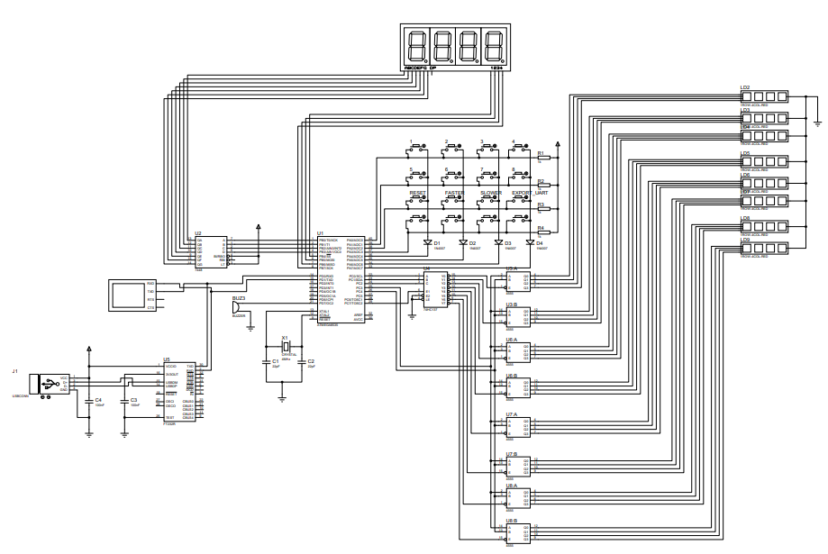
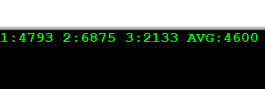

# BmstuMkCourseWork

/src - исходный код

/sim - файлы проектов в Proteus (до v4.0: Proteus 8.9; для v4.0+: Proteus 8.13 Pro)

/media - файлы чертежей и документации

## Задание

## Аппаратное обеспечение

## формат сообщени в UART

Значение каждого измерения и среднее значение (в примере К=3)

